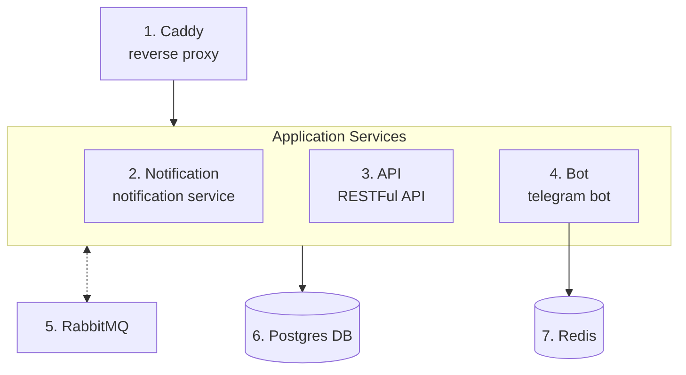

## Barber-bot
Бот для администрации салона красоты, позволяющий пользователям записываться к нужному мастеру с выбором времени, мастерам отслеживать записи через интерактивный календарь.

## 1. Функционал
- Веб-панель (WIP) - интерактивный календарь для мастеров; админ-панель для администратора
- Регистрация и JWT-аунтефикация для защиты панели и api
- Меню управлениями записями (создание, просмотр, удаление, перенос) для пользователя через бота
- Отправка уведомлений пользователям для напоминания об активных записях, предупреждений о переносе записи

## 2. Архитектура


## 3. Структура проекта
```
├── README.md
├── apps                     # Сервисы
│   ├── api                  # RESTFul API (fastapi)
│   ├── bot                  # Telegram bot (aiogram 3.x)
│   └── notification_service # Сервис уведомлений
├── libs                     # Общие библиотеки
│   └── core_shared          # Работа с db и бизнес-логика (sqlalchemy 2.x)
├── docker-compose.prod.yaml # Docker compose для продакшен-деплоя
├── docker-compose.yaml      # Docker compose для dev
└── pyproject.toml           # Настройки проекта
```

## 4. Технологический стек
1. *Языки/Фреймворки:* Python 3.14, FastAPI, pydantic, SQLAlchemy 2.x + alembic, aiogram 3.x
1. *Пакетный менеджер, линтеры:* uv, ruff
1. *Базы данных:* PostgresSQL, Redis (aiogram FSM)
1. *Инфраструктура:* Docker, Docker Compose, Github Actions (CI/CD)
1. *Брокер сообщений:* RabbitMQ

## 5. Быстрый запуск
Используйте эти команды для быстрого deployment-а приложения на ваш сервер. Миграции alembic применяются автоматически прямо в docker-compose
```
1. git clone https://github.com/sasha4ka/book-bot && cd book-bot
2. vim .env # Создайте и заполните файл .env в соответствии с .env.example
3. docker compose -f "docker-compose.prod.yaml" up -d
```

## 6. Локальная разработка
### Настройка окружения
```bash
1. curl -LsSf https://astral.sh/uv/install.sh | sh # Установка пакетного менеджера uv
2. git clone https://github.com/sasha4ka/book-bot && cd book-bot
3. uv sync
3. vim .env # Настройте переменный окружения в соответствии с .env.example
```
### Работа с проектом
```bash
Запуск линтера
uv run ruff check --fix

Запуск и сборка контейнеров
docker compose up --build -d
```
### Alembic миграции
```bash
cd libs/core_shared  # Перейдите в директорию библиотеки

export POSTGRES_URL="URL вашей базы данных"

uv run alembic revision --autogenerate -m "Описание миграции"  # Новая миграция

uv run alembic upgrade head  # Применить миграции
```
### Запуск сервисов без docker
```bash
1. Заполните apps/{}/.env в соответствии с docker-compose.yaml
2. Бот: cd apps/bot && uv run run-bot
3. Сервис уведомлений: cd apps/notification_service && uv run run-notification-service
4. API: cd apps/api && uv run uvicorn api.main:app --reload --host 0.0.0.0 --port 9000 --app-dir src/
```
### Поддержка vscode
Для среды разработки Visual Studio Code в проекте настроена работа с линтером ruff и также настроен список рекомендуемых расширений
